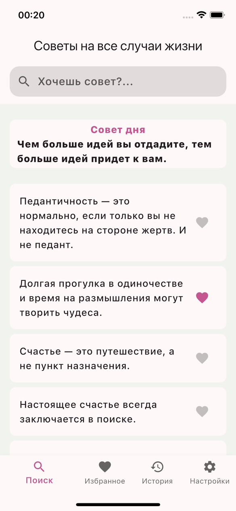
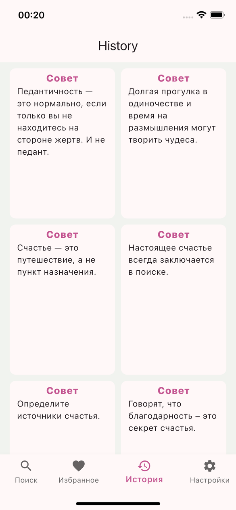
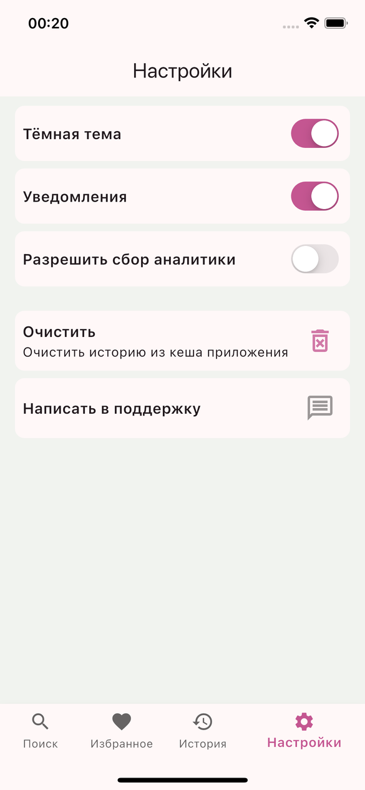

<!-- Header with promo image -->
<p align="center">
  
</p>

<h1 align="center">Advice Me ✨</h1>
<p align="center">
  <strong>Ваш персональный генератор мудрых советов</strong>
</p>

<p align="center">
  <a href="https://flutter.dev">
    
  </a>
  <a href="https://dart.dev">
    
  </a>
  <a href="LICENSE">
    
  </a>
  <br>
  
</p>

---

## 🎯 О приложении

**Advice Me** — это минималистичное Flutter-приложение, которое помогает находить вдохновение и мотивацию через случайные советы. Идеально подходит для ежедневного использования, когда нужно быстро получить порцию мудрости.

### ✨ Ключевые особенности

| Фича | Описание |
|------|----------|
| 🎲 Случайные советы | Получайте новые идеи одним тапом |
| 📜 История просмотров | Сохраняйте и пересматривайте понравившиеся советы |
| 🌓 Тёмная тема | Комфортный режим для любого времени суток |
| 🔔 Уведомления | Напоминалки для ежедневной мотивации |
| 🗑️ Очистка кеша | Полный контроль над вашими данными |
| ⚡ Быстро и легко | Минималистичный интерфейс без лишнего |

---

## 📱 Скриншоты

| Главная | История | Настройки |
|---------|---------|-----------|
|  |  |  |


---

## 🚀 Быстрый старт

### Требования

- Flutter **3.19+**
- Dart **3.3+**
- Android SDK / Xcode (для нативной сборки)

### Установка

```bash
# 1. Клонируйте репозиторий
git clone https://github.com/rddeveloper2019/advice_me.git
cd advice_me

# 2. Установите зависимости
flutter pub get

# 3. Настройте окружение
cp .env.example .env  # при необходимости

# 4. Запустите приложение
flutter run